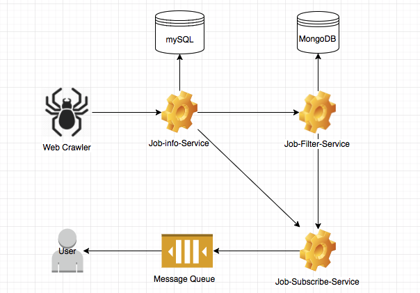

#Job Search System
**Job Search System** is an Spring Boot application using machine learning techniques based on microservices architecture.

## Feature List:
- Crawl and storage job information
- Train model to filter job information
- Filter and select job information based on user's demand
- Send filtered job information to user

## System Architecture

### Web Crawler
The Web Crawler is designed to extra job information from the websites and creat json files send to Job Info Service.

### Job Info Service
The Job Info Service support CRUD operations and storage the data into Database

### Job Filter Service
The Job Filter Service train logistic regression base on user training document.

### Job Subscribe Service
The Job Subscribe Service will get model information from filter service and get data from Job Info Service, then select jobs and seed to user.

## Requirement
* Java Platform (JDK) 8
* Apache Maven
* Docker

## Intallation and Run